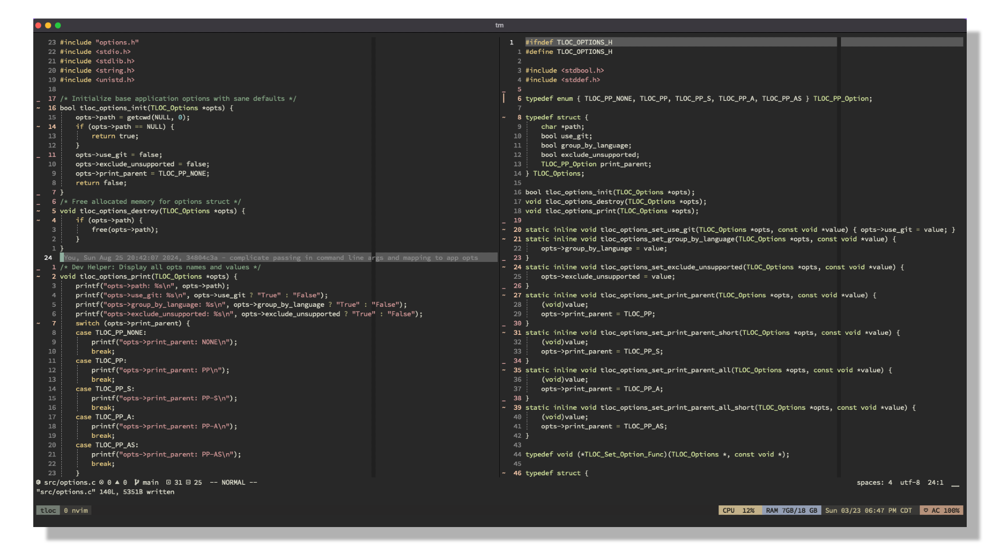

# Ascua.nvim 🔥

> Neovim color scheme inspired by [Zenburn](https://github.com/jnurmine/Zenburn) and [Notepad++ dark theme](https://github.com/notepad-plus-plus/notepad-plus-plus)

## Installation

Using `vim-plug`

```vim
Plug 'navazjm/ascua.nvim'
```

Using `packer`

```lua
use 'navazjm/ascua.nvim'
```

Using `lazy.nvim`

```lua
{
    "navazjm/ascua.nvim",
    name = "ascua",
    lazy = false,
    priority = 1000,
    config = function()
        vim.cmd("colorscheme ascua")
    end
}
```

## Usage

```lua
-- Lua

-- use colors from this colorscheme by requiring ascua.colors!
local c = require("ascua.colors").get_colors()

require("ascua").setup({
    -- NOTE: each option is set to their default values.

    -- bold text like `keywords`, `constants`, and so on.
    bold_styles = false,

    -- Override colors (see ./lua/ascua/colors.lua)
    color_overrides = {
        white = "#FFFFFF",
    },

    -- Override highlight groups (see ./lua/ascua/theme.lua)
    group_overrides = {
        -- this supports the same val table as vim.api.nvim_set_hl
        Cursor = { fg = c.bg_primary, bg = c.fg_cursor, bold = true },
    },

    -- Enable italic comments
    italic_comments = false,

    -- Underline `@markup.link.*` variants
    underline_links = false,

    -- Apply theme colors to terminal
    terminal_colors = true,

    -- Enable transparent background
    transparent = false,
})

-- load the theme
vim.cmd.colorscheme("ascua")
```

Using `lazy.nvim`

```lua
{
    "navazjm/ascua.nvim",
    name = "ascua",
    lazy = false,
    priority = 1000,
    opts = {
        bold_styles = false,
        color_overrides = {
            white = "#FFFFFF",
        },
        group_overrides = {
            Cursor = { fg = c.bg_primary, bg = c.fg_cursor, bold = true },
        },
        italic_comments = false,
        underline_links = false,
        terminal_colors = true,
        transparent = false,
    },
    config = true,
    init = function()
        vim.cmd("colorscheme ascua")
    end
}
```

If you are using [`lualine`](https://github.com/hoob3rt/lualine.nvim), you can also enable the provided theme:

```lua
require("lualine").setup({
    options = {
        -- ...
        theme = "ascua",
        -- ...
    },
})
```

## Screenshots



> Font: SauceCodePro Nerd Font Mono

## Supported Plugins

- [Git Signs](https://github.com/lewis6991/gitsigns.nvim)
- [Indent Blankline](https://github.com/lukas-reineke/indent-blankline.nvim)
- [LSP](https://github.com/neovim/nvim-lspconfig)
- [Lualine](https://github.com/hoob3rt/lualine.nvim)
- [Telescope](https://github.com/nvim-telescope/telescope.nvim)
- [Treesitter](https://github.com/nvim-treesitter/nvim-treesitter)
- [nvim-cmp](https://github.com/hrsh7th/nvim-cmp)

## Extras

Checkout [extras](./extras) to find color schemes for your favorite tools!

## Contributing 

Want to contribute to Ascua.nvim? Awesome, we would love your input ♥

Checkout our [contributing guide](./docs/contributing.md).

## License

Ascua.nvim is licensed under [MIT](./LICENSE)

